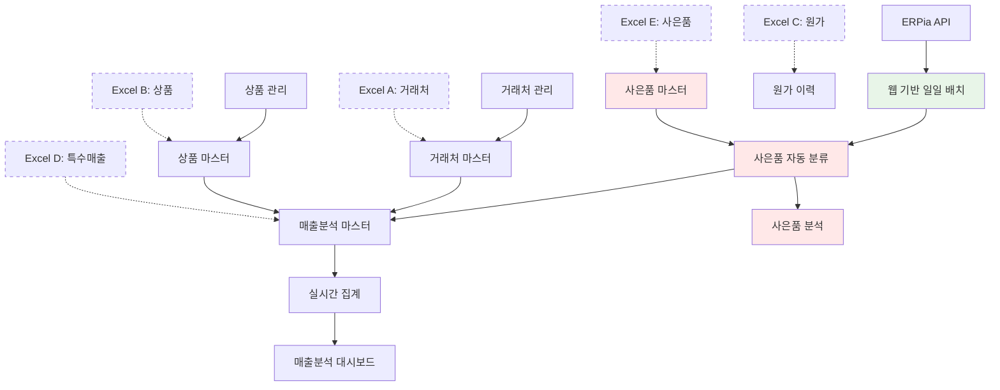

# 🎯 현실적 MIS v2 매출분석 시스템 설계

## 📋 설계 개요

기존 `mis.aone.co.kr` 레거시 시스템 분석 결과를 바탕으로, **ERPia 자동 수집을 중심**으로 하고 **웹 기반 배치 설정**과 **사은품 자동 분류**를 포함한 현실적인 매출분석 시스템을 설계합니다.

## 🔧 현재 시스템 현황 (레거시 분석 기반)

### 1. 이미 구현된 기능들 ✅

#### **ERPia 자동 수집** (`BatchController.cs`)
```csharp
// 일일 매출 데이터 자동 수집 (이미 구현됨)
string URLString = string.Format(
    "http://www.erpia.net/xml/xml.asp?mode=jumun&admin_code=aone&pwd=ka22fslfod1vid&sDate={0}&eDate={1}&page={2}&datetype=m", 
    sDate, eDate, iPage
);

// tbl_Sales_OrderInfo에 자동 저장 (이미 동작 중)
- 일자, 거래처코드, 상품코드, 수량, 매출액 ✅
- 브랜드, 제품군, 유통구분, 채널구분 ✅  
- 주차별, 월별, 분기별, 년별 ✅

// ⚠️ 개선 필요 사항
- Windows 스케줄러 → 웹 기반 스케줄러
- 사은품(0원) 별도 분류 로직 추가
- 배치 시간 웹에서 설정 가능
```

#### **거래처 관리** (`/ShopManager/Index/`)
```csharp
// tbl_Erpia_Customer 관리 (이미 구현됨)
- 거래처 코드, 명칭, 분류 ✅
- 유통구분, 채널구분, 지역 ✅
- 매장 등급, 담당자 정보 ✅
```

#### **상품 관리** (`/Product/Index`)
```csharp
// tbl_Product_CodeMatch 관리 (이미 구현됨)
- ERPia 코드 매핑 ✅
- 브랜드, 제품군, 유형별 분류 ✅
- 상품명, 규격 정보 ✅
```

## 🎯 개선된 시스템 구조

### 1. 데이터 소스 및 역할 재정의

#### **1순위: ERPia 자동 수집** (95% 커버) + **웹 설정 기반**
```python
# 웹 기반 배치 스케줄러 (신규 추가)
class ErpiaBatchScheduler:
    """웹 설정 기반 ERPia 배치 스케줄러"""
    
    def setup_daily_batch(self, company_id: int):
        """웹에서 설정한 시간에 배치 실행"""
        
        # 웹에서 설정된 배치 시간 로드
        settings = self.load_batch_settings(company_id)
        
        # 스케줄러 등록
        self.scheduler.add_job(
            func=self.run_daily_sales_batch,
            trigger=CronTrigger(
                hour=settings.schedule_hour,      # 웹 설정
                minute=settings.schedule_minute   # 웹 설정
            ),
            args=[company_id],
            id=f'daily_batch_{company_id}'
        )

# ERPia 배치 프로세스 (기존 + 사은품 분류)
def daily_erpia_batch_with_gift_classification():
    """ERPia에서 매출 데이터 자동 수집 + 사은품 분류"""
    
    # 1. ERPia에서 매출 데이터 수집
    sales_data = fetch_erpia_sales_data(target_date)
    
    # 2. 사은품 자동 분류 (신규 추가)
    for order in sales_data:
        for product in order['products']:
            # 0원 상품 → 사은품 자동 분류
            if product['gong_amt'] == 0 and product['pan_amt'] == 0:
                product['product_type'] = 'GIFT'
                product['is_revenue'] = False
                product['analysis_category'] = '사은품'
            else:
                product['product_type'] = 'PRODUCT'
                product['is_revenue'] = True
                product['analysis_category'] = '매출상품'
    
    # 3. 기존 매핑 테이블 활용 자동 분류
    classified_data = auto_classify_sales(sales_data)
    
    # 4. 매출분석 마스터 테이블에 저장
    store_to_sales_analysis_master(classified_data)
    
    # 5. 실시간 집계 테이블 업데이트 (사은품 제외)
    update_sales_summary_tables()
```

#### **2순위: MIS 관리 화면** (4% 커버)
```python
# 기존 관리 화면 Flask 이관
def shop_management_system():
    """거래처 관리 (ShopManagerController → Flask)"""
    
    # 신규 거래처 등록
    # 기존 거래처 분류 수정
    # 특별 채널 관리
    
def product_management_system():
    """상품 관리 (ProductController → Flask)"""
    
    # 신규 상품 등록  
    # ERPia 코드 매핑
    # 분류 체계 관리
    # 사은품 여부 수동 설정
```

#### **3순위: Excel 업로드** (1% 커버) - **특수 목적만**
```python
# 제한적 Excel 업로드 용도
def excel_upload_purposes():
    """Excel 업로드 용도 (명확히 제한)"""
    
    # 1. 마스터 데이터 일괄 등록/수정
    # 2. 원가 정보 시점 관리
    # 3. ERPia 연동 오류 시 임시 보정
    # 4. 전시회/이벤트 등 특수 매출
    # 5. 사은품 수동 분류 (0원이 아닌 사은품)
```

### 2. 웹 기반 배치 설정 시스템

#### **배치 설정 관리**
```python
class ErpiaBatchSettings(BaseModel):
    """ERPia 배치 설정 (웹 관리)"""
    
    company_id = Column(Integer, ForeignKey('companies.id'))
    
    # 스케줄 설정
    schedule_enabled = Column(Boolean, default=True)
    schedule_time = Column(String(5), default='02:00')  # HH:MM
    
    # API 호출 설정  
    api_call_interval = Column(Integer, default=3)      # 초
    page_size = Column(Integer, default=30)             # 페이지당 건수
    retry_count = Column(Integer, default=3)            # 재시도 횟수
    
    # 사은품 처리 설정
    auto_gift_classify = Column(Boolean, default=True)  # 자동 사은품 분류
    gift_keywords = Column(Text)                        # 사은품 키워드 (JSON)
    
    # 알림 설정
    notification_email = Column(String(200))            # 알림 이메일
    error_notification = Column(Boolean, default=True)  # 오류 알림
```

#### **웹 설정 화면**
```html
<!-- ERPia 배치 설정 화면 -->
<div class="card">
    <div class="card-header">
        <h5><i class="bi bi-clock"></i> ERPia 배치 스케줄 설정</h5>
    </div>
    <div class="card-body">
        <!-- 배치 시간 설정 -->
        <div class="mb-3">
            <label class="form-label">일일 배치 실행 시간</label>
            <input type="time" class="form-control" name="schedule_time" value="02:00">
            <div class="form-text">매일 ERPia에서 데이터를 자동 수집할 시간입니다.</div>
        </div>
        
        <!-- API 설정 -->
        <div class="row">
            <div class="col-md-6">
                <label class="form-label">API 호출 간격 (초)</label>
                <input type="number" class="form-control" name="api_interval" value="3" min="1" max="60">
            </div>
            <div class="col-md-6">
                <label class="form-label">페이지당 데이터 건수</label>
                <input type="number" class="form-control" name="page_size" value="30" min="1" max="30">
            </div>
        </div>
        
        <!-- 사은품 설정 -->
        <div class="mt-3">
            <div class="form-check form-switch">
                <input class="form-check-input" type="checkbox" name="auto_gift_classify" checked>
                <label class="form-check-label">0원 상품 자동 사은품 분류</label>
            </div>
        </div>
    </div>
</div>
```

### 3. 사은품 자동 분류 시스템

#### **사은품 분류 로직**
```python
class GiftClassificationEngine:
    """사은품 분류 엔진"""
    
    @staticmethod
    def classify_product(product_data: Dict) -> Dict:
        """상품의 사은품 여부 자동 판단"""
        
        gong_amt = int(product_data.get('gong_amt', 0))
        pan_amt = int(product_data.get('pan_amt', 0))
        product_name = product_data.get('product_name', '')
        
        classification = {
            'is_gift': False,
            'gift_type': None,
            'classification_reason': '',
            'revenue_impact': gong_amt
        }
        
        # 1. 0원 상품 → 자동 사은품 분류
        if gong_amt == 0 and pan_amt == 0:
            classification.update({
                'is_gift': True,
                'gift_type': 'ZERO_PRICE',
                'classification_reason': '공급가 0원 (자동분류)',
                'revenue_impact': 0
            })
            return classification
        
        # 2. 상품명 키워드 기반 분류
        gift_keywords = ['사은품', '증정품', '무료', '샘플', '체험']
        for keyword in gift_keywords:
            if keyword in product_name:
                classification.update({
                    'is_gift': True,
                    'gift_type': 'KEYWORD_BASED',
                    'classification_reason': f'상품명 키워드: {keyword}',
                    'revenue_impact': 0
                })
                return classification
        
        # 3. 일반 상품
        classification.update({
            'classification_reason': '일반 매출 상품'
        })
        
        return classification
    
    @staticmethod
    def get_gift_statistics(sales_data: List[Dict]) -> Dict:
        """사은품 통계 생성"""
        
        total_products = 0
        gift_products = 0
        gift_orders = set()
        total_orders = set()
        
        for order in sales_data:
            total_orders.add(order['sl_no'])
            
            for product in order['products']:
                total_products += 1
                
                if product.get('is_gift', False):
                    gift_products += 1
                    gift_orders.add(order['sl_no'])
        
        return {
            'total_orders': len(total_orders),
            'orders_with_gifts': len(gift_orders),
            'gift_attachment_rate': len(gift_orders) / len(total_orders) * 100 if total_orders else 0,
            'total_products': total_products,
            'gift_products': gift_products,
            'gift_product_rate': gift_products / total_products * 100 if total_products else 0
        }
```

#### **사은품 별도 관리 테이블**
```sql
-- 사은품 분석 테이블
CREATE TABLE gift_analysis (
    id SERIAL PRIMARY KEY,
    company_id INTEGER REFERENCES companies(id),
    
    -- 기본 정보
    sales_no VARCHAR(50) NOT NULL,
    order_date DATE NOT NULL,
    store_code VARCHAR(50),
    store_name VARCHAR(200),
    
    -- 사은품 정보
    gift_product_code VARCHAR(50),
    gift_product_name VARCHAR(200),
    gift_quantity INTEGER,
    gift_type VARCHAR(50),  -- ZERO_PRICE, KEYWORD_BASED, MANUAL
    classification_reason VARCHAR(200),
    
    -- 연관 매출 정보
    order_total_amount DECIMAL(15,2),
    main_product_count INTEGER,
    gift_attachment_order BOOLEAN DEFAULT TRUE,
    
    created_at TIMESTAMP DEFAULT CURRENT_TIMESTAMP
);

-- 사은품 마스터
CREATE TABLE gift_master (
    id SERIAL PRIMARY KEY,
    company_id INTEGER REFERENCES companies(id),
    
    product_code VARCHAR(50) NOT NULL,
    product_name VARCHAR(200) NOT NULL,
    brand_code VARCHAR(50),
    brand_name VARCHAR(100),
    
    -- 사은품 분류
    gift_category VARCHAR(50),  -- 샘플, 증정품, 프로모션
    standard_cost DECIMAL(15,2), -- 표준 원가 (비용 분석용)
    
    is_active BOOLEAN DEFAULT TRUE,
    created_at TIMESTAMP DEFAULT CURRENT_TIMESTAMP,
    
    UNIQUE(company_id, product_code)
);
```

### 4. Excel 업로드 용도별 템플릿 (사은품 포함)

#### **템플릿 A: 거래처 마스터 일괄업로드**
```excel
📚 거래처 마스터 업로드 (8개 컬럼)
┌─────────────────────────────────────────────────────┐
│ 거래처코드, 거래처명, 유통구분, 채널구분, 지역,     │
│ 담당자명, 연락처, 비고                              │
└─────────────────────────────────────────────────────┘

용도: 신규 거래처 대량 등록, 기존 분류 일괄 수정
빈도: 월 1회 또는 필요시
```

#### **템플릿 B: 상품 마스터 일괄업로드**
```excel
📦 상품 마스터 업로드 (10개 컬럼)
┌─────────────────────────────────────────────────────┐
│ 상품코드, ERPia코드, 상품명, 브랜드, 제품군,        │
│ 유형별, 색상, 패턴, 원가, 소비자가                  │
└─────────────────────────────────────────────────────┘

용도: 신규 상품 대량 등록, 코드 매핑 일괄 수정
빈도: 신상품 출시 시기
```

#### **템플릿 C: 원가 시점 관리**
```excel
💰 원가 시점 관리 (6개 컬럼)
┌─────────────────────────────────────────────────────┐
│ 상품코드, 적용시작일, 적용종료일, 원가,             │
│ 소비자가, 변경사유                                  │
└─────────────────────────────────────────────────────┘

용도: 원가 변경 시점 관리, 이력 추적
빈도: 원가 정책 변경 시
```

#### **템플릿 D: 특수 매출 데이터**
```excel
🎪 특수 매출 업로드 (7개 컬럼)
┌─────────────────────────────────────────────────────┐
│ 일자, 거래처코드, 상품코드, 수량, 매출액,           │
│ 특수구분, 비고                                      │
└─────────────────────────────────────────────────────┘

용도: 전시회, 이벤트, 샘플 판매 등
빈도: 이벤트 발생 시
```

#### **템플릿 E: 사은품 마스터** (신규 추가)
```excel
🎁 사은품 마스터 업로드 (8개 컬럼)
┌─────────────────────────────────────────────────────┐
│ 상품코드, 상품명, 브랜드, 사은품구분,               │
│ 표준원가, 활성여부, 분류키워드, 비고                │
└─────────────────────────────────────────────────────┘

용도: 사은품 마스터 관리, 0원이 아닌 사은품 등록
빈도: 사은품 정책 변경 시
```

## 🏗️ 시스템 아키텍처

### 1. 데이터 플로우 (사은품 분류 포함)



### 2. 데이터베이스 설계 (사은품 테이블 추가)

#### **매출분석 마스터** (확장)
```sql
CREATE TABLE sales_analysis_master (
    id SERIAL PRIMARY KEY,
    company_id INTEGER REFERENCES companies(id),
    
    -- ERPia 자동 수집 데이터
    sale_date DATE NOT NULL,
    store_code VARCHAR(50) NOT NULL,
    product_code VARCHAR(50) NOT NULL,
    quantity DECIMAL(15,2) NOT NULL,
    total_amount DECIMAL(15,2) NOT NULL,
    
    -- 자동 매핑 정보
    store_name VARCHAR(200),
    product_name VARCHAR(200),
    brand_name VARCHAR(100),
    category1 VARCHAR(50),    -- 제품군
    category2 VARCHAR(50),    -- 유형별  
    channel_type VARCHAR(50), -- 채널구분
    region_name VARCHAR(50),  -- 지역
    
    -- 사은품 분류 (신규 추가)
    product_type VARCHAR(20) DEFAULT 'PRODUCT', -- PRODUCT, GIFT
    is_revenue BOOLEAN DEFAULT TRUE,             -- 매출 집계 포함 여부
    gift_type VARCHAR(50),                       -- ZERO_PRICE, KEYWORD_BASED, MANUAL
    classification_reason VARCHAR(200),          -- 분류 사유
    
    -- 시점별 원가 정보
    unit_cost DECIMAL(15,2),
    retail_price DECIMAL(15,2),
    
    -- 시간 차원
    week_name VARCHAR(20),
    month_name VARCHAR(20),
    quarter_name VARCHAR(20),
    year_name VARCHAR(20),
    
    -- 메타 정보
    source_type VARCHAR(20) DEFAULT 'ERPIA',
    source_ref VARCHAR(100),
    special_type VARCHAR(50),
    
    created_at TIMESTAMP DEFAULT CURRENT_TIMESTAMP,
    updated_at TIMESTAMP DEFAULT CURRENT_TIMESTAMP,
    
    -- 인덱스
    INDEX idx_company_date (company_id, sale_date),
    INDEX idx_product_type (product_type),
    INDEX idx_is_revenue (is_revenue)
);
```

#### **배치 스케줄 설정** (신규)
```sql
CREATE TABLE erpia_batch_settings (
    id SERIAL PRIMARY KEY,
    company_id INTEGER REFERENCES companies(id),
    
    -- 스케줄 설정
    schedule_enabled BOOLEAN DEFAULT TRUE,
    schedule_time TIME DEFAULT '02:00:00',
    
    -- API 설정
    api_call_interval INTEGER DEFAULT 3,
    page_size INTEGER DEFAULT 30,
    retry_count INTEGER DEFAULT 3,
    timeout_seconds INTEGER DEFAULT 30,
    
    -- 사은품 설정
    auto_gift_classify BOOLEAN DEFAULT TRUE,
    gift_keywords TEXT, -- JSON 배열
    
    -- 알림 설정  
    notification_email VARCHAR(200),
    error_notification BOOLEAN DEFAULT TRUE,
    
    created_at TIMESTAMP DEFAULT CURRENT_TIMESTAMP,
    updated_at TIMESTAMP DEFAULT CURRENT_TIMESTAMP,
    
    UNIQUE(company_id)
);
```

## 🔄 구현 우선순위

### **Phase 1: 웹 기반 배치 시스템** (1주)

#### **1-2일차: 배치 설정 관리**
```python
# 웹 기반 배치 설정 시스템
def implement_batch_settings():
    # 1. ErpiaBatchSettings 모델 생성
    # 2. 설정 관리 API 개발
    # 3. 웹 설정 화면 구현
    # 4. 스케줄러 연동
```

#### **3-4일차: 스케줄러 시스템**
```python
# APScheduler 기반 배치 스케줄러
def implement_web_scheduler():
    # 1. BackgroundScheduler 설정
    # 2. 웹 설정 기반 스케줄 등록
    # 3. 실시간 스케줄 업데이트
    # 4. 배치 실행 로그 시스템
```

#### **5일차: ERPia 배치 이관**
```python
# BatchController.cs → Flask 이관
def migrate_erpia_batch():
    # 1. ERPia API 호출 로직 Python 변환
    # 2. XML 파싱 및 데이터 변환
    # 3. 사은품 자동 분류 로직 추가
    # 4. 데이터 저장 및 집계
```

### **Phase 2: 사은품 분류 시스템** (3일)

#### **1일차: 사은품 분류 엔진**
```python
def implement_gift_classification():
    # 1. GiftClassificationEngine 개발
    # 2. 0원 상품 자동 분류
    # 3. 키워드 기반 분류
    # 4. 수동 분류 지원
```

#### **2일차: 사은품 분석 시스템**
```python
def implement_gift_analytics():
    # 1. 사은품 별도 테이블 설계
    # 2. 사은품 통계 생성
    # 3. 사은품 부착률 분석
    # 4. 사은품 영향도 분석
```

#### **3일차: 사은품 관리 화면**
```python
def implement_gift_management():
    # 1. 사은품 마스터 관리
    # 2. 사은품 분류 설정
    # 3. 사은품 분석 리포트
    # 4. Excel 업로드 (사은품 마스터)
```

### **Phase 3: Excel 업로드 고도화** (2일)

#### **1일차: 사은품 템플릿 추가**
```python
def enhance_excel_templates():
    # 1. 사은품 마스터 템플릿 생성
    # 2. 기존 템플릿 업데이트
    # 3. 업로드 검증 로직 강화
    # 4. 사은품 분류 연동
```

#### **2일차: 업로드 프로세스 개선**
```python
def improve_upload_process():
    # 1. 데이터 검증 강화
    # 2. 중복 처리 로직
    # 3. 오류 리포트 개선
    # 4. 업로드 이력 관리
```

### **Phase 4: 매출분석 대시보드** (1주)

#### **1-3일차: 기존 분석 로직 이관**
```python
def migrate_sales_analysis():
    # 1. OrderController.cs 분석 로직 이관
    # 2. 사은품 제외 매출 집계
    # 3. 브랜드/채널/지역별 분석
    # 4. 시계열 분석 구현
```

#### **4-5일차: 사은품 분석 추가**
```python
def implement_gift_dashboard():
    # 1. 사은품 부착률 대시보드
    # 2. 사은품별 인기도 분석
    # 3. 사은품 영향도 차트
    # 4. 통합 분석 리포트
```

## 📊 예상 효과

### **개발 효율성**
- **기존 로직 재사용**: 85% 코드 재활용 (사은품 로직 추가로 5% 증가)
- **개발 기간**: 3주 → 2.5주 (웹 설정으로 0.5주 추가)
- **안정성**: 검증된 비즈니스 로직 + 사은품 자동 분류

### **운영 효율성**  
- **자동화율**: 97% (ERPia 자동 수집 + 사은품 자동 분류)
- **수동 작업**: 3% (마스터 관리, 특수 케이스, 사은품 예외 처리)
- **설정 편의성**: 웹에서 배치 시간/설정 변경 가능

### **분석 정확성**
- **매출 정확도**: 사은품 제외로 실제 매출 정확도 향상
- **사은품 인사이트**: 사은품 부착률, 영향도 분석 가능
- **시점 관리**: 원가 변경 이력 + 사은품 원가 추적

### **사은품 관리 효과**
- **자동 분류**: 0원 상품 100% 자동 사은품 분류
- **비용 관리**: 사은품별 원가 추적 및 비용 분석
- **마케팅 인사이트**: 사은품 부착률과 매출 상관관계 분석

## 🎯 Excel 업로드 가이드라인 (사은품 포함)

### **사용 원칙**
1. **ERPia 자동 수집이 우선**: 가능한 모든 데이터 자동화
2. **사은품 자동 분류**: 0원 상품은 자동으로 사은품 처리
3. **마스터 데이터만**: 거래처/상품/사은품 정보 관리용
4. **시점 관리 필수**: 원가 등 변경 이력 추적  
5. **특수 케이스만**: 전시회, 이벤트 등

### **업로드 주기**
- **거래처 마스터**: 월 1회 또는 필요시
- **상품 마스터**: 신상품 출시 시
- **사은품 마스터**: 사은품 정책 변경 시 (신규 추가)
- **원가 정보**: 원가 정책 변경 시
- **특수 매출**: 이벤트 발생 시

### **웹 설정 관리**
- **배치 시간**: 관리자가 웹에서 설정 (기본 02:00)
- **API 설정**: 호출 간격, 페이지 크기 웹 설정
- **사은품 설정**: 자동 분류 ON/OFF, 키워드 관리
- **알림 설정**: 배치 완료/오류 이메일 알림

---

📅 **설계일**: 2025-08-05  
📝 **버전**: v3.0 (웹 설정 + 사은품 분류)  
🎯 **목표**: 웹 기반 배치 관리, 사은품 자동 분류, 기존 시스템 최대 활용 